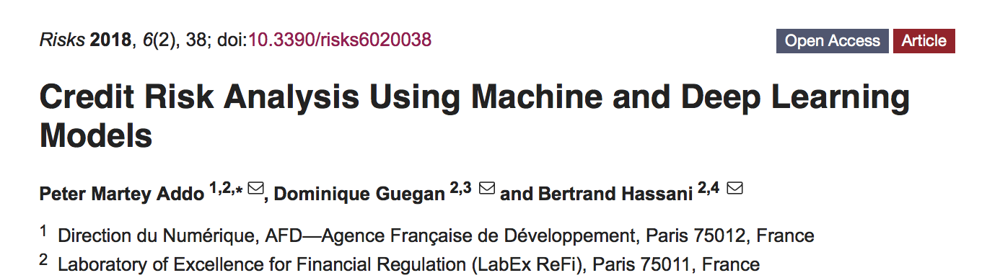

```{r setup, include=FALSE}
knitr::opts_chunk$set(
	echo = TRUE,
	message = FALSE,
	warning = FALSE
)
```

In this document, we provide codes used in the paper [http://www.mdpi.com/2227-9091/6/2/38](paper). Given that we can not provide access to the dataset, we have generated data with 10 observations keeping the same structure as original data. We made use of [https://www.h2o.ai](H2o), which is an open-source machine learning platform for enterprises.  

# Loading Packages, Reading and loading data

```{r results='hide', message=FALSE, warning=FALSE}
suppressMessages(library(h2o))
Sys.setenv(JAVA_HOME="/Library/Java/JavaVirtualMachines/jdk1.8.0_152.jdk/Contents/Home")
suppressMessages(h2o.init(max_mem_size = "6g"))
h2o.no_progress() # Don't show progress bars in RMarkdown output
```


We import the full dataset and split in 3 ways: 60% for training, 20% for validation (hyper parameter tuning) and 20% for final testing.

```{r results='hide', message=FALSE, warning=FALSE}
df <- h2o.importFile(path = normalizePath("creditdata.csv"))
dim(df)

# Reformating features
df$DEFAULT <- as.factor(df$DEFAULT) #encode the binary repsonse as a factor
df$CLIENTID <- as.factor(df$CLIENTID) # client id
df$CLIENT <- as.factor(df$CLIENT) # client

#Split data into Train/Validation/Test Sets
# ==> essential to ensure that the model we built works well on the new datasets when deployed in a real production environment

splits <- h2o.splitFrame(df, c(0.6,0.2), seed=1234)
train  <- h2o.assign(splits[[1]], "train.hex") # 60%
valid  <- h2o.assign(splits[[2]], "valid.hex") # 20%
test   <- h2o.assign(splits[[3]], "test.hex")  # 20%

```

## saving a copy of data
```{r}
h2o.exportFile(train, path = "./data4drive/train.csv")
h2o.exportFile(valid, path = "./data4drive/valid.csv")
h2o.exportFile(test, path = "./data4drive/test.csv")
```

# Overview of Dataset and descriptive Statistics

## Cross Tabulation

```{r}
h2o.table(df[,"DEFAULT"])

h2o.table(df[,c("DEFAULT","CLIENTID")])#Cross Tabulation client againt default

dd<-h2o.table(df[,c("DEFAULT","CLIENTID")])
dd[dd$DEFAULT == '1',]  


tail(h2o.arrange(dd[dd$DEFAULT == '1',],Counts),20) # Top 20 defaulting clients
```

## Kernel Density of Default Counts

```{r}

lol<- as.data.frame(dd[dd$DEFAULT == '1',] [,2:3]) # Convert to dataframe
d <- density(lol$Counts)
plot(d, main="Kernel Density of Default Counts")
polygon(d, col="red", border="blue")
```


# Prepare data for Modelling

```{r}

#We want to predict the `DEFAULT` column

response <- "DEFAULT"
predictors <- setdiff(names(df), c(response,"CLIENT","CLIENTID","DATE"))
```


# (Optional) Use only if you want to Load Original Split data saved

```{r}
# Load Original Split data for replications (Only for replication purpose)
# remove the dataset test, train, valid already load :p 

rm(list = c("test","train","valid"))

# Load originally saved splits for replication 
train <- h2o.importFile(path = normalizePath("./data4drive/train.csv"))
test <- h2o.importFile(path = normalizePath("./data4drive/test.csv"))
valid <- h2o.importFile(path = normalizePath("./data4drive/valid.csv"))


```

```{r}
# look at the counts per class in the training set:
h2o.table(train[response])
```

# Balancing Train data 

We will use Synthetic Minority Over-sampling Technique [*SMOTE*](https://www.jair.org/media/953/live-953-2037-jair.pdf) to balance the train data. 

```{r}
library(DMwR)
trainR <- as.data.frame(train) # convert h2o data to R dataframe to be able to use SMOTE

prop.table(table(trainR$DEFAULT)) # check proportion of rare events
trainR$DATE <- as.numeric(trainR$DATE) # reformate 
trainR[is.na(trainR)] <- 0 # set missing values to zero
trainR$DEFAULT <- as.factor(trainR$DEFAULT) # reformate target as factor

# SMOTE algorithm implementation
trainR <- SMOTE(DEFAULT ~ predictors, trainR, perc.over = 600, perc.under=100)
prop.table(table(trainR$DEFAULT))
```


```{r}
train <- as.h2o(trainR,"train.hex")
```


# Modeling

We will start by considering the following models GLM (Elastic Net with logistic function and  regularisation), Gradient - Boosting Machines (gbm), Random Forest, multilayer artificial neural network.

## Building a GLM Model


```{r}
glm_model <- h2o.glm(x = predictors, y = response, training_frame = train, model_id = "glm_model",
                     solver = "IRLSM", standardize = T, link = "logit",
                     family = "binomial", alpha = 0.5,lambda = 1.92e-6,seed = 2000000) # lambda_search = TRUE, lambda = 1.92E-6

summary(glm_model)
```


## Random Forest and GBM algorithms

Checks on the model summary in terms of performance metrics including Validation performance and variable importance
### Random Forest

```{r}
rf_model <- h2o.randomForest(         
  training_frame = train,       
  validation_frame = valid,     
  x=predictors,                        ## the predictor columns, by column index
  y=response,                          ## the target index (what we are predicting)
  model_id = "rf_credit",    ## name the model
  ntrees = 120,                  ## use a maximum of 120 trees to create the forest model.
  stopping_rounds = 2,           ## Stop fitting new trees when the 2-tree average is within 0.001
  score_each_iteration = T,      ## Predict against training and validation for each tree.
  seed = 2000000 ## Set the random seed so that this can be reproduced.
)          
###############################################################################
summary(rf_model)                     ## View information about the model.
```

### Gradient Boosting Machine


```{r}
gbm_model <- h2o.gbm(
  training_frame = train,     ##
  validation_frame = valid,   ##
  x=predictors,                     ##
  y=response,                       ##
  ntrees = 120,                ## add a few trees
  learn_rate = 0.3,           ## increase the learning rate even further
  max_depth = 10,             ##
  sample_rate = 0.7,          ## use a random 70% of the rows to fit each tree
  col_sample_rate = 0.7,       ## use 70% of the columns to fit each tree
  stopping_rounds = 2,        ##
  stopping_tolerance = 0.01,  ##
  score_each_iteration = T,   ##
  model_id = "gbm_credit",
  seed = 2000000)             ##
#######
summary(gbm_model)
```

## Deep Learning

### Model DL1
In our first model. We will only run for one epoch (one pass over the training data) with a large network
```{r}
dl.model.1 <- h2o.deeplearning(
  model_id="dl_model_1",
  training_frame=train,
  validation_frame=valid,   ## used for scoring and early stopping
  x=predictors,
  y=response,
  #activation="Rectifier",  ## default
  hidden=c(120,120),       
  epochs=1,
  variable_importances=T,
  seed = 2000000
)
summary(dl.model.1)
```

### Model DL2
We consider *early stopping* to let it stop automatically once the misclassification rate converges. In addition, we also sample the validation set to 1000 rows for faster scoring.
```{r}

dl.model.2 <- h2o.deeplearning(
  model_id="dl_model_2",
  training_frame=train,
  validation_frame=valid,
  x=predictors,
  y=response,
  hidden=c(40,40,40),                  
  epochs=1000,                     
  score_validation_samples=1000,      ## sample the validation dataset (faster)
  stopping_rounds=2,
  stopping_metric="AUTO",      ## we can consider "MSE","logloss","r2","misclassification"
  stopping_tolerance=1e-2,      ## stop when misclassification does not improve by >=1% for 2 scoring
  seed = 2000000
)
summary(dl.model.2)

```

### Model DL3
In this model, we consider *tuning* the model and adding *L1/L2 regularization*.  

```{r}
dl.model.3 <- h2o.deeplearning(
  model_id="dl_model_3",
  training_frame=train,
  validation_frame=valid,
  x=predictors,
  y=response,
  overwrite_with_best_model=T,    ## Return the final model best after 10 epochs
  hidden=c(120,120,120),          ## more hidden layers -> more complex interactions
  epochs=10,                      ## to keep it short enough
  score_validation_samples=10000, ## downsample validation set for faster scoring
  score_duty_cycle=0.025,         ## don't score more than 2.5% of the wall time
  adaptive_rate=F,                ## manually tuned learning rate
  rate=0.01,
  rate_annealing=2e-6,            
  momentum_start=0.2,             ## manually tuned momentum
  momentum_stable=0.4,
  momentum_ramp=1e7,
  l1=1e-5,                        ## add some L1/L2 regularization
  l2=1e-5,
  max_w2=10,                       ## helps stability for Rectifier
  seed = 2000000
)
summary(dl.model.3)
```

### Model DL4
Given that there are a lot of parameters that can impact model accuracy, hyper-parameter tuning is especially important for Deep Learning. In this model, we specify a *grid of hyperparameters* for model tuning.
We allow the search to stop once the top 5 models are within 1% of each other. Thus, when the windowed average varies less than 0.01.

```{r}
sampled_train=train[1:10000,] # we will only train on the first 10,000 rows of the training dataset

hyper_params <- list(
  activation=c("Rectifier","Tanh","Maxout","RectifierWithDropout","TanhWithDropout","MaxoutWithDropout"),
  hidden=list(c(20,20),c(50,50),c(30,30,30),c(25,25,25,25)),
  input_dropout_ratio=c(0,0.05),
  l1=seq(0,1e-4,1e-6),
  l2=seq(0,1e-4,1e-6)
)
# hyper_params

search_criteria = list(strategy = "RandomDiscrete", max_runtime_secs = 360, max_models = 100, seed=1234567, stopping_rounds=5, stopping_tolerance=1e-2)
dl.model.4 <- h2o.grid(
  algorithm="deeplearning",
  grid_id = "dl_model_grid",
  training_frame=sampled_train,
  validation_frame=valid, 
  x=predictors, 
  y=response,
  epochs=1,
  stopping_metric="AUTO",
  stopping_tolerance=1e-2,        ## stop when logloss does not improve by >=1% for 2 scoring events
  stopping_rounds=2,
  score_validation_samples=10000, ## downsample validation set for faster scoring
  score_duty_cycle=0.025,         ## don't score more than 2.5% of the wall time
  max_w2=10,                      ## can help improve stability for Rectifier
  hyper_params = hyper_params,
  search_criteria = search_criteria,
  seed = 2000000
)                                

```


Find the best model and its full set of parameters
```{r}
grid <- h2o.getGrid("dl_model_grid",sort_by="logloss",decreasing=FALSE) #sort_by="err"
#grid # list of model
```

```{r}
grid@summary_table[1,]
dl.model.4.best <- h2o.getModel(grid@model_ids[[1]]) ## model with lowest logloss
dl.model.4.best
```


## Accuracy comparision on Valid data

### Compare Performance on valid data using the above models

Compare the valid set performance of the above models.
```{r}
base_models <- list(M1=glm_model@model_id, M2=rf_model@model_id,M3=gbm_model@model_id, D1=dl.model.1@model_id,D2=dl.model.2@model_id,D3=dl.model.3@model_id,D4=dl.model.4.best@model_id)

# Compare to base learner performance on the valid set
get_auc_valid <- function(mm) h2o.auc(h2o.performance(h2o.getModel(mm), newdata = valid))
baselearner_aucs_valid <- sapply(base_models, get_auc_valid)
baselearner_best_auc_valid <- max(baselearner_aucs_valid)

# Compare to base learner performance on the valid set using RMSE
get_rmse_valid <- function(mm) h2o.rmse(h2o.performance(h2o.getModel(mm), newdata = valid))
baselearner_rmse_valid <- sapply(base_models, get_rmse_valid)
baselearner_best_rmse_valid <- max(baselearner_rmse_valid)

models_auc_rmse_list_valid <- cbind(base_models,baselearner_aucs_valid,baselearner_rmse_valid)
models_auc_rmse_list_valid
```
```{r}
library(stargazer)
stargazer(models_auc_rmse_list_valid, title="Compare Performance on valid dataset")
```

### Plot of ROC curves on valid data
```{r}
par(mfrow=c(3,2))
plot(h2o.performance(glm_model,newdata = valid),col=2, main = "ROC curve on valid data for GLM")
plot(h2o.performance(rf_model,newdata = valid),col=2, main = "ROC curve on valid data for RF")
plot(h2o.performance(gbm_model,newdata = valid),col=2, main = "ROC curve on valid data for GBM")
plot(h2o.performance(dl.model.1,newdata = valid),col=2, main = "ROC curve on valid data for DL 1")
plot(h2o.performance(dl.model.2,newdata = valid),col=2, main = "ROC curve on valid data for DL 2")
plot(h2o.performance(dl.model.3,newdata = valid),col=2, main = "ROC curve on valid data for DL 3")
plot(h2o.performance(dl.model.4.best,newdata = valid),col=2, main = "ROC curve on valid data for DL 4")

```


## Accuracy comparision on Test data

### Compare Performance on Test data using the above models

Compare the valid set performance of the above models.
```{r}
base_models <- list(M1=glm_model@model_id, M2=rf_model@model_id,M3=gbm_model@model_id, D1=dl.model.1@model_id,D2=dl.model.2@model_id,D3=dl.model.3@model_id,D4=dl.model.4.best@model_id)

# Compare to base learner performance on the test set
get_auc_test <- function(mm) h2o.auc(h2o.performance(h2o.getModel(mm), newdata = test))
baselearner_aucs_test <- sapply(base_models, get_auc_test)
baselearner_best_auc_test <- max(baselearner_aucs_test)

# Compare to base learner performance on the test set using RMSE
get_rmse_test <- function(mm) h2o.rmse(h2o.performance(h2o.getModel(mm), newdata = test))
baselearner_rmse_test <- sapply(base_models, get_rmse_test)
baselearner_best_rmse_test <- max(baselearner_rmse_test)

models_auc_rmse_list_test <- cbind(base_models,baselearner_aucs_test,baselearner_rmse_test)
models_auc_rmse_list_test
```

```{r}
stargazer(models_auc_rmse_list_test, title="Compare Performance on test dataset")
```

### Plot of ROC curves on Test data
```{r}
par(mfrow=c(2,3))
plot(h2o.performance(glm_model,newdata = test),col=2, main = "ROC curve on Test data for GLM")
plot(h2o.performance(rf_model,newdata = test),col=2, main = "ROC curve on Test data for RF")
plot(h2o.performance(gbm_model,newdata = test),col=2, main = "ROC curve on Test data for GBM")
plot(h2o.performance(dl.model.1,newdata = test),col=2, main = "ROC curve on Test data for DL 1")
plot(h2o.performance(dl.model.2,newdata = test),col=2, main = "ROC curve on Test data for DL 2")
plot(h2o.performance(dl.model.3,newdata = test),col=2, main = "ROC curve on Test data for DL 3")
plot(h2o.performance(dl.model.4.best,newdata = test),col=2, main = "ROC curve on Test data for DL 4")

```


# Variable Importance

## Comparision of Variable Importance for all models
```{r}
library(knitr)
glm.VI <- glm_model@model$standardized_coefficient_magnitudes
rf.VI<- rf_model@model$variable_importances 
gbm.VI<-h2o.varimp(gbm_model) # Variable importance
dl.model.1.VI<-h2o.varimp(dl.model.1)
dl.model.2.VI<-h2o.varimp(dl.model.2)
dl.model.3.VI<-h2o.varimp(dl.model.3)
dl.model.4.VI<-h2o.varimp(dl.model.4.best)

VI.models <- cbind.data.frame(glm.VI[1:10,]$names,rf.VI[1:10,]$variable,gbm.VI$variable[1:10],dl.model.1.VI$variable[1:10],dl.model.2.VI$variable[1:10],dl.model.3.VI$variable[1:10],dl.model.4.VI$variable[1:10])
colnames(VI.models) <-c("GLM","RF","GBM","DL1","DL2","DL3","DL4")

kable(VI.models,caption = "Variable Importance from Models")
```

```{r}
stargazer(VI.models, summary=FALSE, rownames=FALSE,title = "Top 10 Variable Importance from Models")
```

# Top 10 Testing on model performance testing 

## Top 10 VIP for models (seed kept same)
```{r}
predictors_glm <-c("RE1","RE27","RE18","RE8","RE28","RE30","RE10","RE3","RE7","CD3")
#predictors_rf <-c("MEX2_TRN","RE28","RE27","RE1","EF7","RE25","RE24","MEX11","CD1","RE12_TRN")
#predictors_gbm <-c("MEX2_TRN","RE30","RC11_TRN","RE14_TRN","EV1","EV10_TRN","MEX2","L1","EF5","T3")
#predictors_dl1 <-c("MEX5_TRN","RE30","L2","EF18","RE10","RC1_TRN","CD3","RE1","L1_TRN","EV8_TRN")
#predictors_dl2 <-c("MEX2_TRN","EF20_TRN","EF3_TRN","EV13","RE4_TRN","RC12_TRN","RC10_TRN","MEX5","MEX6","T5_TRN")
#predictors_dl3 <-c("EV1_TRN","EF16_TRN","CIERRECONT","MEX5_TRN","TERR_FDO_N","EV2_TRN","SEC_FDO_N","MEX4","TERR_FDO_TRN","EF2")
#predictors_dl4 <-c("EF16","RE10","CD1_TRN","EV6","RE17","L4","RE6_TRN","L3","EF2","TERR_FDO_N")

predictors_glm <-predictors_glm
```


## More on Building a GLM Model


```{r}
glm_model_pred_glm <- h2o.glm(x = predictors_glm, y = response, training_frame = train, model_id = "glm_model_pred_glm",
                              solver = "IRLSM", standardize = T, link = "logit",
                              family = "binomial", alpha = 0.5,lambda = 1.92e-6, seed = 2000000) # lambda_search = TRUE, lambda = 1.92E-6
```

```{r}
rf_model_pred_glm <- h2o.randomForest(         
  training_frame = train,       
  validation_frame = valid,     
  x=predictors_glm,                        ## the predictor columns, by column index
  y=response,                          ## the target index (what we are predicting)
  model_id = "rf_model_pred_glm",    ## name the model
  ntrees = 120,                  ## use a maximum of 120 trees to create the forest model.
  stopping_rounds = 2,           ## Stop fitting new trees when the 2-tree average is within 0.001
  score_each_iteration = T,      ## Predict against training and validation for each tree.
  seed = 2000000 ## Set the random seed so that this can be reproduced.
)                              ## View information about the model.
```

```{r}
gbm_model_pred_glm <- h2o.gbm(
  training_frame = train,     ##
  validation_frame = valid,   ##
  x=predictors_glm,                     ##
  y=response,                       ##
  ntrees = 120,                ## add a few trees
  learn_rate = 0.3,           ## increase the learning rate even further
  max_depth = 10,             ##
  sample_rate = 0.7,          ## use a random 70% of the rows to fit each tree
  col_sample_rate = 0.7,       ## use 70% of the columns to fit each tree
  stopping_rounds = 2,        ##
  stopping_tolerance = 0.01,  ##
  score_each_iteration = T,   ##
  model_id = "gbm_model_pred_glm",
  seed = 2000000)             ##
```

```{r}
dl.model.1_pred_glm <- h2o.deeplearning(
  model_id="dl_model_1_pred_glm",
  training_frame=train,
  validation_frame=valid,   ## used for scoring and early stopping
  x=predictors_glm,
  y=response,
  #activation="Rectifier",  ## default
  hidden=c(120,120),       
  epochs=1,
  variable_importances=T,
  seed = 2000000
)
```

```{r}

dl.model.2_pred_glm <- h2o.deeplearning(
  model_id="dl_model_2_pred_glm",
  training_frame=train,
  validation_frame=valid,
  x=predictors_glm,
  y=response,
  hidden=c(40,40,40),                  
  epochs=1000,                     
  score_validation_samples=1000,      ## sample the validation dataset (faster)
  stopping_rounds=2,
  stopping_metric="AUTO",      ## we can consider "MSE","logloss","r2","misclassification"
  stopping_tolerance=1e-2,
  seed = 2000000 ## stop when misclassification does not improve by >=1% for 2 scoring
)
```

```{r}
dl.model.3_pred_glm <- h2o.deeplearning(
  model_id="dl_model_3_pred_glm",
  training_frame=train,
  validation_frame=valid,
  x=predictors_glm,
  y=response,
  overwrite_with_best_model=T,    ## Return the final model best after 10 epochs
  hidden=c(120,120,120),          ## more hidden layers -> more complex interactions
  epochs=10,                      ## to keep it short enough
  score_validation_samples=10000, ## downsample validation set for faster scoring
  score_duty_cycle=0.025,         ## don't score more than 2.5% of the wall time
  adaptive_rate=F,                ## manually tuned learning rate
  rate=0.01,
  rate_annealing=2e-6,            
  momentum_start=0.2,             ## manually tuned momentum
  momentum_stable=0.4,
  momentum_ramp=1e7,
  l1=1e-5,                        ## add some L1/L2 regularization
  l2=1e-5,
  max_w2=10,                       ## helps stability for Rectifier
  seed = 2000000
)
```


```{r}
dl.model.4_pred_glm <- h2o.deeplearning(
  model_id="dl_model_4_pred_glm",
  training_frame=train,
  validation_frame=valid,
  x=predictors_glm,
  y=response,
  hidden=c(30,30,30),          ## more hidden layers -> more complex interactions
  epochs=1,
  stopping_metric="AUTO",
  stopping_tolerance=1e-2,        ## stop when logloss does not improve by >=1% for 2 scoring events
  stopping_rounds=2,
  score_validation_samples=10000, ## downsample validation set for faster scoring
  score_duty_cycle=0.025,         ## don't score more than 2.5% of the wall time
  max_w2=10,       
  adaptive_rate=T,                ## manually tuned learning rate
  l1=6e-5,                        ## add some L1/L2 regularization
  l2=9.1e-5,
  activation="Maxout",
  seed = 2000000
)
```


Compare the test set performance of the above models.
```{r}

base_models_pred_glm <- list(M1=glm_model_pred_glm@model_id, M2=rf_model_pred_glm@model_id,M3=gbm_model_pred_glm@model_id, D1=dl.model.1_pred_glm@model_id,D2=dl.model.2_pred_glm@model_id,D3=dl.model.3_pred_glm@model_id,D4=dl.model.4_pred_glm@model_id)

# Compare to base learner performance on the test set using AUC
get_auc_pred_glm <- function(mm) h2o.auc(h2o.performance(h2o.getModel(mm), newdata = test))
baselearner_aucs_pred_glm <- sapply(base_models_pred_glm, get_auc_pred_glm)
baselearner_best_auc_test_pred_glm <- max(baselearner_aucs_pred_glm)

# Compare to base learner performance on the test set using RMSE
get_rmse_pred_glm <- function(mm) h2o.rmse(h2o.performance(h2o.getModel(mm), newdata = test))
baselearner_rmse_pred_glm <- sapply(base_models_pred_glm, get_rmse_pred_glm)
baselearner_best_rmse_test_pred_glm <- min(baselearner_rmse_pred_glm)

models_auc_rmse_list_pred_glm <- cbind(Models=base_models_pred_glm,AUC=baselearner_aucs_pred_glm,RMSE=baselearner_rmse_pred_glm)

models_auc_rmse_list_pred_glm

print(sprintf("Best Base-learner Test AUC using Top 10 glm:  %s", baselearner_best_auc_test_pred_glm))
```


```{r}
stargazer(models_auc_rmse_list_pred_glm, title="Performance Using the Top 10 features from DL4 on Test dataset")
```


```{r results='hide', message=FALSE, warning=FALSE}
# All done, shutdown H2O
h2o.shutdown(prompt=FALSE)
```




